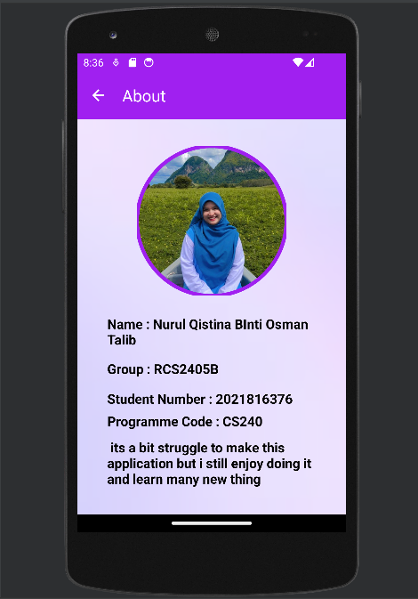
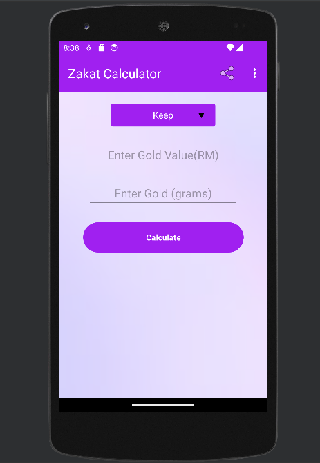
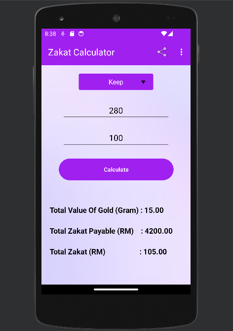
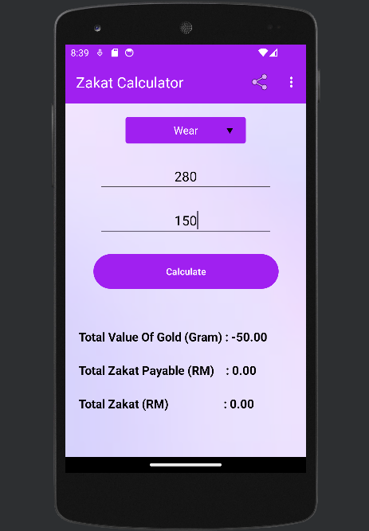

# ZakatCalculator
xxxxxxxxxxxxxxxxxxxxxxxxxxxxxxxxxxxxxxxxxxxxxxxxxxxxxxxxxxxxxxxxxxxxxxxxxxxxxxxxxxxxxxxxxxxxxxxxxxxxxxxxxxxx
 
 Hello everyone👋 ,

I'm Nurul Qistina Binti Osman Talib, and I wanted to share that I'm currently working on the Zakat calculator project for ICT602 with Sir Hafiz. My matric number is 2021816376, and I'm from the CS240 course at UiTM Arau. The project involves developing a mobile application for estimating zakat payment for gold keeping. I hope everything is going well, and I'm excited about the potential benefits of this project for all of us.

Cheers 💕😄 ,
Nurul

xxxxxxxxxxxxxxxxxxxxxxxxxxxxxxxxxxxxxxxxxxxxxxxxxxxxxxxxxxxxxxxxxxxxxxxxxxxxxxxxxxxxxxxxxxxxxxxxxxxxxxxxxxxx

1.Develop mobile application for estimating zakat payment for gold keeping. 

The inputs expected for the application are:
- The weight of the gold in grams
- Type of gold (keep or wear) (keep = 85gram, wear = 200 gram)
- Current gold value per gram 

The application is expected to output:
- The total value of the gold : weight in gram - X gram
- Total gold value that is zakat payable : (weight in gram – X gram) * value 
- The total zakat : 2.5% * (total gold value that is zakat payable)

Note: The X is 85 grams for gold keeping category and 200 grams for wearing category

## my information

## interface (button, textview, color, icon of share)

## calculation example

